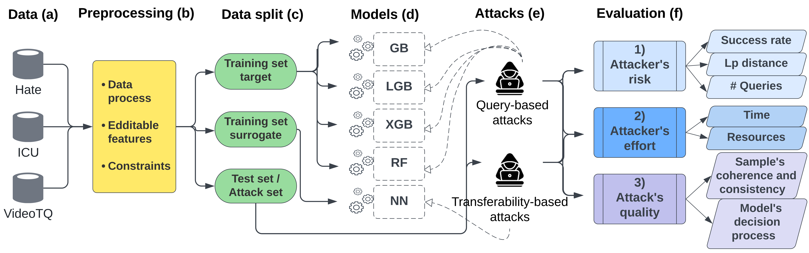

# Addressing Key Challenges of Adversarial Attacks and Defenses in the Tabular Domain: A Methodological Framework for Coherence and Consistency

[](https://doi.org/10.1016/j.asoc.2025.113998)
[](
https://doi.org/10.48550/arXiv.2412.07326)


## Abstract

Machine learning models trained on tabular data are vulnerable to adversarial attacks, even in realistic scenarios where attackers only have access to the model’s outputs. Since tabular data contains complex dependencies among features, it presents a unique challenge for adversarial samples which must maintain coherence and respect these dependencies to remain indistinguishable from benign data. Moreover, existing attack evaluation metrics-such as the success rate, perturbation magnitude, and query count-fail to account for this challenge.

To address these gaps, we propose a technique for perturbing dependent features while preserving sample coherence. In addition, we introduce Class-Specific Anomaly Detection (CSAD), an effective novel anomaly detection approach, along with concrete metrics for assessing the quality of tabular adversarial attacks. CSAD evaluates adversarial samples relative to their predicted class distribution, rather than a broad benign distribution. This ensures that subtle adversarial perturbations, which may appear coherent in other classes, are correctly identified as anomalies. We extend CSAD for importance-based anomaly detection by integrating SHAP explainability techniques to detect inconsistencies in model decision-making.

Our evaluation of adversarial sample quality incorporates both anomaly detection rates and importance-based assessments to provide a more comprehensive measure. We evaluate various attack strategies, examining black-box query-based and transferability-based gradient attacks across four target classification models. Experiments on benchmark tabular datasets reveal key differences in the attacker’s risk and effort and attack quality, offering insights into the strengths, limitations, and trade-offs faced by attackers and defenders. Our findings lay the groundwork for future research on adversarial attacks and defense development in the tabular domain.

# Overview


# Contents
1. Processed datasets
    * Hate
    * ICU
2. Models
    * Gradient Boosting
    * Light Gradient Boost
    * Xgboost
    * Random Forest
3. Edditable-Features file for each dataset
4. Adversarial Attacks for tabular models
    * boundary attack
    * HopSkipJump attack
    * iterative transferable attack

#Pythom Packages Requirments
The Xgboost models required pip install ...
The ...

## Citation

```bibtex
@article{itzhakev2025addressing,
  title={Addressing key challenges of adversarial attacks and defenses in the tabular domain: A methodological framework for coherence and consistency},
  author={Itzhakev, Yael and Giloni, Amit and Elovici, Yuval and Shabtai, Asaf},
  journal={Applied Soft Computing},
  pages={113998},
  year={2025},
  publisher={Elsevier}
}
```
